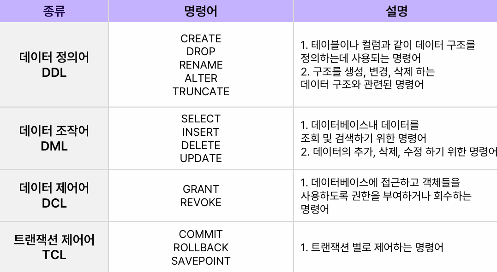
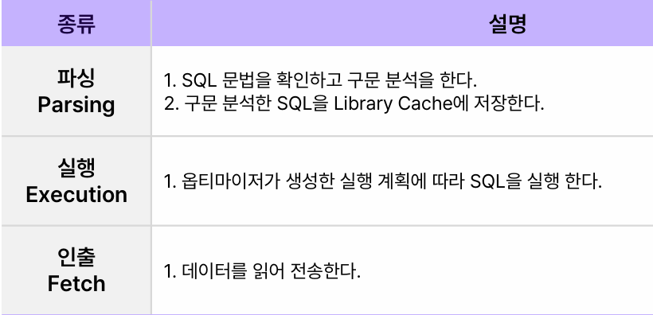
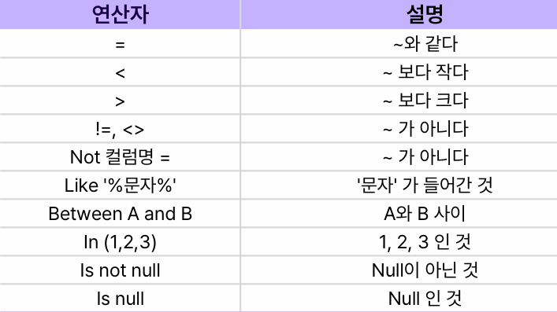
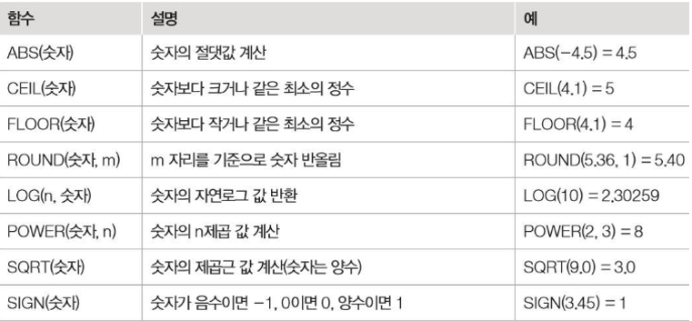
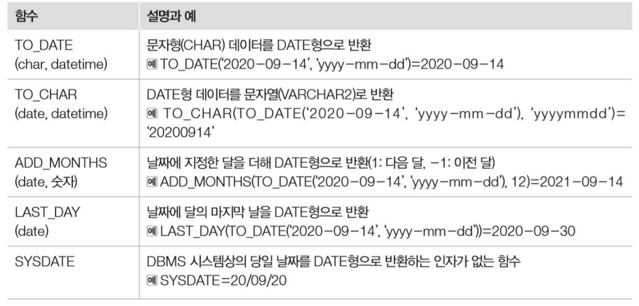
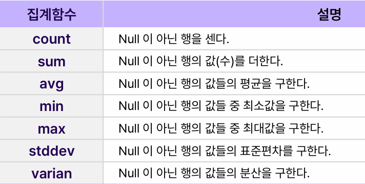

# SQL
> 관계형 데이터베이스에서 데이터 정의, 조작, 제어를 하기 위해 사용하는 언어이다.

<br>

- SQL 명령어의 종류


<br>

- SQL 처리 순서



<br>
<br>
<br>

## SELECT
> 테이블내 저장된 데이터를 조회하기 위해 사용 

``` sql
select 컬럼명
from 테이블명
where 출력할 데이터 조건


-- 예시1 user테이블에서 id가 123인 데이터의 모든 컬럼을 출력
select *
from user
where id=123;

-- 예시2 user테이블에서 id가 123인 데이터의 id와 name을 출력
select id,name
from user
where id=123;
```

<br>
<br>

- order by : 데이터를 오름차순 및 내림차순으로 정렬할 수 있다.
    - 기본은 오름차순으로 뒤에 desc를 붙이면 내림차순이 된다.

``` sql
select id, name
from user
where id  jk123
order by id desc;   -- 내림차순
```

<br>
<br>

- distinct : select절의 컬럼 앞에 위치하며 중복을 제거한 결과를 출력한다.
    -  `select distinct type from table`;

<br>

- alias는 테이블명 또는 컬럼명의 길이가 길거나 복잡할때, 함수를 사용했을 때 사용한다.
    - `select type as 유형 from table;`
    - as를 생략해도 된다.


<br>
<br>

- where절 연산자


<br>
<br>

- dual 테이블 : 오라클에서 간단하게 함수를 테스트하거나, 데이터를 테스트할때 사용 할 수 있는 더미 테이블이다.
    - 모든 사용자에게 권한이 열려 있다.

<br>
<br>
<br>

## 함수
> 함수는 크게 DBMS에서 제공하는 내장함수와 사용자 정의 함수가 있다. 내장 함수 안에서도 문자를 다루는 문자함수, 숫자함수, 날짜함수, 집계함수 등으로 나눌 수 있다.

<br>

- 문자 함수


<br>
<br>

- 숫자 함수


<br>
<br>

- 날짜 함수


```sql
-- 추가
select sysdate, systimestamp
from dual;

-- SYSDATE : 데이터베이스 서버의 현재 날짜와 시간을 반환
-- SYSTIMESTAMP : 데이터베이스 서버의 현재 날짜와 시간, 타임스탬프를 반환
```

<br>
<br>

- 집계 함수 <br>



<br>
<br>
<br>


## Group by
> 데이터에서 하나 혹은 여러행을 기준으로 같은 데이터를 기준으로 그룹을 지은 뒤 합계, 평균, max, min 등 집계함수를 이용하여 계산할 수 있는 기능이다.

<br>
- Having 절을 추가하여 group by된 상태에서 조건을 추가 할 수 있다.

```sql
select do, avg(budget_value) as 예산평균, 
sum(budget_value) as 예산합계
from budget
group by do
having avgbudgetvalue 50000;
```

<br>
<br>
<br>


## 분기문

- nvl : null값을 제거하기 위한 일반 함수
    - null 대신 특정 숫자나 다른 값을 출력 가능
    - nvl(값, 'null일 때 출력 값')

<br>

- nvl2 : nvl과 달리 파라미터가 3개
    - nvl2(값, 'null이 아닐 때 출력 값', 'null일 때 출력 값')

<br>

```sql
select id, name, 
nvl(bonus_type, '해당없음'), 
nvl2(bonus, '보너스 대상자', '미 대상자')
from salary;
```


<br>
<br>

- decode : 한 컬럼에 다양한 조건을 적용하여 출력할 때 사용한다.
    - decode(값, 조건1, 결과1, 조건2, 결과2…)

```sql
select id, name, decode(bonus_type, 'AB', '1등급', 'AC', '2등급', 
'FA', '4등급', '미 대상자') 
from salary;
```

<br>
<br>

- case when : 여러가지 컬럼 및 조건으로 다양한 조건을 적용해야 할 때 사용한다.
    - 하나의 컬럼 값으로 비교할 때와 여러 컬럼으로 비교 할 때와 문법을 두가지로 나눠 사용 가능
    - 나열된 순으로 조건 비교를 한다.

``` sql
SELECT 
    id, 
    name, 
    CASE 
        WHEN bonus_type = 'AB' THEN '1등급'
        WHEN bonus_type = 'AC' THEN '2등급'
        WHEN bonus_type = 'FA' THEN '4등급'
        ELSE '미대상자'
    END AS case1,
    CASE bonus_type
        WHEN 'AB' THEN '1등급'
        WHEN 'AC' THEN '2등급'
        WHEN 'FA' THEN '4등급'
        ELSE '미대상자'
    END AS case2
FROM salary;
```

<br>
<br>


## 기타

- rownum : 오라클에서 출력 rows를 설정하는 기능
- rowid : 오라클에서 row가 생성될 때 부여되는 row의 고유 id

<br>

- with문
    - 일종의 임시적인 뷰 테이블
    - 특정 sql 블록의 재사용을 위해 사용
    - sql 실행 속도면에서 유리
    - 여러번 사용될 수록 유리
    - 하나의 sql문에서 여러개의 with문 사용
```sql 
WITH sql1 AS (
    SELECT * 
    FROM salary 
    WHERE ROWNUM <= 5
), 
sql2 AS (
    SELECT * 
    FROM salary 
    WHERE ROWNUM <= 2
)
SELECT * FROM sql1
UNION ALL
SELECT * FROM sql2;
```
