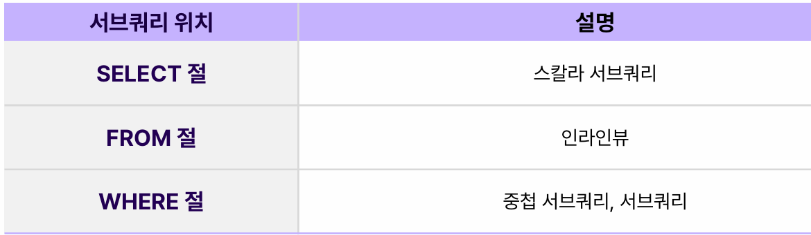
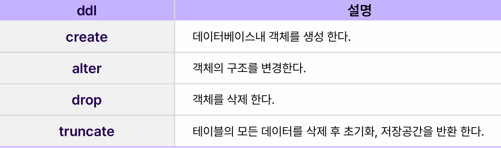
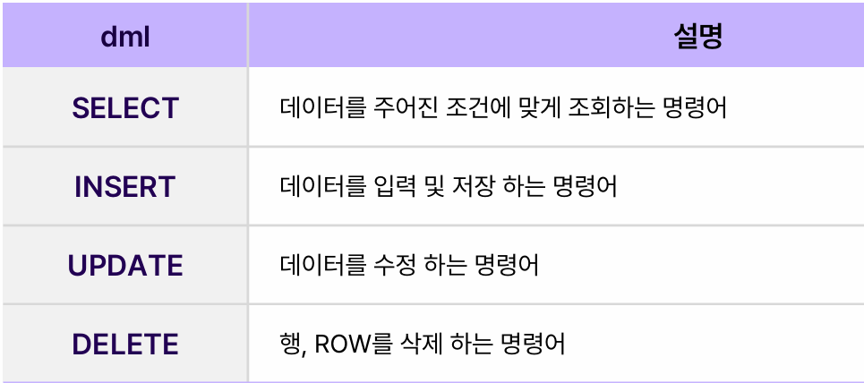
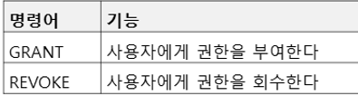
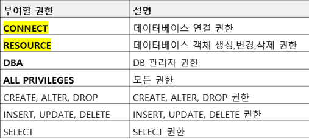
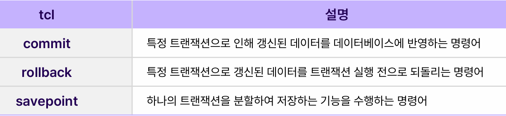
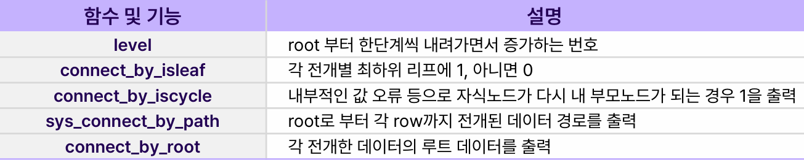
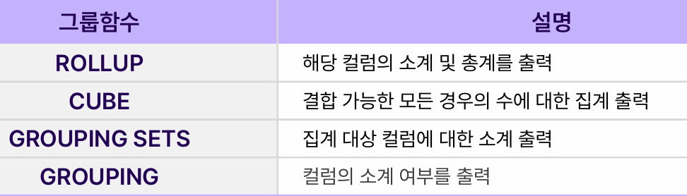
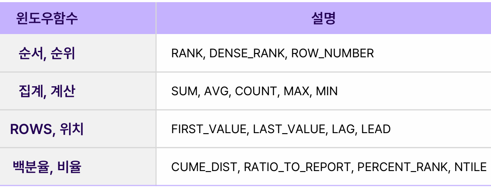

# SQL심화

<br>
<br>

## join
> 두개 이상의 테이블을 결합하여 데이터를 출력하는 명령어로 주로 pk와 fk를 사용하여 join이 성립된다.

<br>

1. inner join : 두개의 테이블 간 매칭되는 모든 데이터 조합 중 특정 컬럼(join key)끼리 값이 같은 것만 출력한다. 
    - 가장 보편적인 join 방법으로 inner는 생략가능하다.
``` sql
select *
from major inner join professor
on m.major id p.blmajor id;
```

<br>
<br>

2. natural join : 두 테이블 간의 동일한 이름을 갖는 모든 컬럼들에 대해 자동으로 inner join을 실행
``` sql
select *
from major natural join professor;
```

<br>
<br>

3. cross join : join하는 테이블 간 조인 조건이 없을 때 실행되는 join
    - 두개의 테이블 간에 매칭되는 모든 데이터 조합을 출력
    - 카티션곱과 동의어
    - join조건을 따로 정의하지 않는다.

```sql
-- 두개의 결과는 동일
select *
from major, professor;

select *
from major cross join professor;
```


<br>
<br>

4. outer join : inner join과 달리 기준이 되는 한쪽은 매칭되는 값이 없어도 출력된다.
    - 동일한 값이 없는 한쪽은 null이 출력된다.

```sql
create table major_outer as select * from major where major_prfs_cnt>6;

--ansi
select *
from professor p left outer join major_outer m 
on m.major_id = p.bl_major_id;

--oracle / right outer join임
select *
from professor p ,major_outer m 
where m.major_id(+) = p.bl_major_id;    -- left면 오른쪽에 (+)를 붙여줌
```


<br>
<br>

5. 비등가 join : 정의된 범위나 같지 않다는 조건으로도 join을 할 수 있다.
    - between A and B를 사용해 join 가능

``` sql
select c.name, c.point, g.name
from customer c join gift g 
on c.point between g.point_s and g.point_e;
```


<br>
<br>
<br>


## 집합연산자


```sql
-- 1. 테이블 생성 쿼리 (point 값이 12인 레코드를 선택)
CREATE TABLE gift_inter AS
SELECT * 
FROM gift 
WHERE point = 12;

-- 2. INTERSECT 연산자 사용 (두 쿼리 결과의 교집합)
SELECT * 
FROM gift
INTERSECT 
SELECT * 
FROM gift_inter;

-- 3. MINUS 연산자 사용 (첫 번째 쿼리에서 두 번째 쿼리 결과를 뺀 값)
SELECT * 
FROM gift
MINUS
SELECT * 
FROM gift_inter;

-- 4. UNION ALL 사용 (두 쿼리 결과를 합침, 중복 허용)
SELECT * 
FROM gift
UNION ALL
SELECT * 
FROM gift;

-- 5. UNION 사용 (두 쿼리 결과를 합침, 중복 제거)
SELECT * 
FROM gift
UNION
SELECT * 
FROM gift;
```

<br>
<br>
<br>

## 서브쿼리
> 하나의 쿼리에 포함되있는 또 다른 select문을 뜻한다. 시작과 끝을 괄호로 감싸서 표시한다.



<br>

- 스칼라 서브쿼리 : select 절, where절, order by 절 등에서 사용 된다. 
    - 성능이 좋지 않다.
```sql
SELECT name,
       (SELECT major_title
        FROM major b
        WHERE b.major_id = a.major_id) AS 학과명
FROM student a;
```

<br>

- 인라인 뷰 : 쿼리에서 중추적인 역할을 한다.
    - from절에 사용되는 서브쿼리의 일종으로 동적뷰라고도 한다.
```sql
SELECT major_id, COUNT(*) AS cnt
FROM (select major_id, count(*) cnt from student group by major_id);

select a.name, b.major_title 
from student a join (select major_title, major_id from major) b
on a.major_id = b.major_id;
```

<br>
<br>

-  exsits, not exsits : 서브쿼리의 결과에 따라 결과셋에 있는것만 출력하거나,없는것만 출력하는 문법이다.
    - exits와 not exsits는 join으로도 구현 가능
    - exists에서는 on 사용 불가능
    - exsits절내 select 절에는 꼭 1이 아니더라도 어떤것을 출력해도 결과는 같다.
    - exists은 존재하는지 여부만 파악하므로 조건을 모두 비교하는 in보다 실행이 빠르다.
```sql
SELECT *
FROM student a
WHERE NOT EXISTS (
    SELECT 1
    FROM major_outer m
    WHERE m.major_id = a.major_id
);
```


<br>
<br>
<br>

## DDL
> 데이터베이스내에 테이블이나 다른 객체의 구조를 정의하는 명령어



``` sql
-- 테이블 생성
CREATE TABLE EMPLOYEESSALARYD (
  ID VARCHAR2(210) NOT NULL PRIMARY KEY,                -- ID 컬럼
  EMPLOYEESID VARCHAR2(210) NOT NULL REFERENCES EMPLOYEES (ID),  -- 외래 키 참조
  NAME VARCHAR2(100),                                   -- 이름
  BONUSTYPE VARCHAR2(23),                               -- 보너스 타입
  SALARY NUMBER,                                        -- 급여
  BONUS NUMBER,                                         -- 보너스
  REGDTDATE DATE                                        -- 등록 날짜
);

-- 컬럼 이름 변경
ALTER TABLE EMPLOYEESSALARYD RENAME COLUMN NAME TO EMPLOYEENAME;

-- BONUSTYPE의 데이터 타입 변경
ALTER TABLE EMPLOYEESSALARYD MODIFY BONUSTYPE VARCHAR2(25) NOT NULL;

-- PRIMARY KEY 삭제
ALTER TABLE EMPLOYEESSALARYD DROP PRIMARY KEY;

-- 외래 키 추가
ALTER TABLE EMPLOYEESSALARYD ADD CONSTRAINT EMPLOYEESEMPLOYEE_IDFK 
  FOREIGN KEY (ID) REFERENCES EMPLOYEES (EMPLOYEE_ID);

drop table 테이블명 (cascade constraint);

truncate table 테이블명;
```


<br>
<br>
<br>

## 뷰
> 물리적 데이터를 가지지 않는 테이블을 바라보는 창문의 역할을 한다.

```sql
 create view 뷰이름 as
 select * from 테이블명 where…; 
```

- 장점 : 보안에 적합, 단순하게 불러옴, 하나의 테이블로 여러 결과를 가진 뷰를 생성 가능, 조직마다 필요한 뷰를 나눠서 사용 가능
- 단점 : 삽입이나 갱신 등 연산이 제한, 데이터 구조를 쉽게 변경할수 없음, 인덱싱이 어려움


<br>
<br>
<br>

## DML
> 데이터베이스 내 데이터를 조회하거나 입력,수정,삭제하는 명령어



```sql
-- 첫 번째 INSERT 문: 값은 괄호로 묶어야 하며, 각 값은 콤마로 구분
INSERT INTO SALARY VALUES ('A06', '독도', 'AA', 1200, 70);

-- 두 번째 INSERT 문: 컬럼명과 VALUES 구문을 정확히 작성
INSERT INTO SALARY (ID, NAME, SALARY) VALUES ('A06', '독도', 1200);

-- 첫 번째 UPDATE 문: SALARY 컬럼을 1150으로 업데이트
UPDATE SALARY SET SALARY = 1150;

-- 두 번째 UPDATE 문: ID가 A04인 레코드의 SALARY를 1150으로 업데이트
UPDATE SALARY SET SALARY = 1150 WHERE ID = 'A04';

-- 세 번째 UPDATE 문: BONUS가 NULL이 아닌 레코드들의 SALARY를 1150으로 업데이트
UPDATE SALARY SET SALARY = 1150 WHERE BONUS_TYPE IS NOT NULL;

-- 네 번째 UPDATE 문: BONUS_TYPE이 AB 또는 AC인 레코드들의 SALARY를 1150으로 업데이트
UPDATE SALARY SET SALARY = 1150 WHERE BONUS_TYPE IN ('AB', 'AC');

-- 첫 번째 DELETE 문: SALARY 테이블에서 모든 레코드를 삭제
DELETE FROM SALARY;

-- 두 번째 DELETE 문: ID가 A04인 레코드를 삭제
DELETE FROM SALARY WHERE ID = 'A04';

```

<br>
<br>
<br>

## DCL
> DB내 유저에 권한을 부여하거나 회수하는 명령어이다.



``` sql
GRANT 부여할 권한 [ON 부여 대상(테이블)]
TO 사용자계정 또는 역할
[WITH GRANT OPTION] -- 추가시 권한을 부여받는 사용자가 다른 사람한테 자신의 권한 부여 가능
[PUBLIC]    -- 해당 권한을 데이터베이스 존재하는 모든 사용자에게 할당할 때 사용

REVOKE <권한리스트> ON <객체명> FROM 사용자리스트
```

<br>

- 부여 가능한 권한


<br>
<br>

- ROLE
    - ROLE은 권한과 유저사이에 존재하는 개념으로, 다양한 권한을 역할에 따라 유저에게 부여 할때 사용할 수 있다.
    - 특정 ROLE은 여러 권한을 받아 놓고, 특정 유저에게 여러 권한들을 가진 ROLE을 부여 함으로 간단하게 권한을 관리할 수 있다.
    - 예를 들면 부서별로 역할을 만들어 권한을 관리할 수 있다.
``` SQL
create role myrole;
grant create session, create table to my_role;
grant my_role to my_user;
```


<br>
<br>
<br>

## TCL
> 트랜잭션을 관리하는 명령어이다.




<br>
<br>
<br>


## 계층형 SQL
> 한 테이블내 데이터로 계층적인 데이터구조를 원하는 형태로 쉽고 편하게 출력하기 위한 SQL문법이다.

- 부모 데이터에서 자식 데이터로 가면 순방향 아니면 역방향
    - ex) prior 자식데이터 = 부모데이터 => 순방향
```SQL
select 컬럼명
from 테이블
where 조건절
start with 시작조건
connect by [nocycle] prior 관계 방향
order [siblings] by 정렬 조건
```

<br>

- 계층형 SQL 관련 함수 및 기능



<br>
<br>
<br>

## 그룹함수
> 테이블내 데이터들을 각 컬럼 별로 그룹화하여 그룹별 결과를 기존 데이터와 함께 출력하는 함수이다. union과 union all로 대체 가능하다. group by 뒤에 사용되는 함수이다.



- 각 그룹함수 특징
    - rollup : 기준 컬럼이 1개일 때 CUBE와 같고 기준 컬럼 순서에 따라 결과 다름
    - grouping sets : 기준 컬럼 순서와 결과는 무관
    - cube : 기준 컬럼이 1개일때 rollup과 같고 기준 컬럼의 순서와 결과는 무관


<br>
<br>
<br>

## 윈도우 함수
> 데이터 분석이나 통계적인 계산을 하는 함수로 주로 사용된다.
- 함수 자체를 중첩하여 사용할 수 없다.
- 다수의 join과 더불어 복잡하게 구해야하는 로직을 쉽게 처리할 수 있다.



<br>

```sql
SELECT 
    classnum,                                -- 학급 번호
    studentno,                               -- 학생 번호
    score,                                   -- 점수
    ROW_NUMBER() OVER (PARTITION BY classnum ORDER BY score) AS class_rank,  -- 각 학급별로 점수 순으로 순위를 매김
    DENSE_RANK() OVER (PARTITION BY classnum ORDER BY score) AS dense_rank,  -- 각 학급별로 점수 순으로 순위를 매기되, 동점자에게 동일 순위를 부여
    SUM(score) OVER (PARTITION BY classnum) AS sumscore,  -- 각 학급별로 점수 합계
    AVG(score) OVER (PARTITION BY classnum) AS avgscore,  -- 각 학급별로 점수 평균
    SUM(score) OVER (PARTITION BY classnum ORDER BY studentno) AS sumscore_ordered  -- 학급별로 학생 번호 순으로 점수 합계
FROM 
    examresult;                             -- 시험 결과 테이블
```
> **PARTITION BY**는 데이터를 여러 개의 그룹으로 나누는 역할


<br>

- lag : 특정 컬럼 값을 순서에 따라 이전 또는 이후 값을 출력할 수 있다. 
    - lead 함수와 기능이 유사하다.

<br>

- percent_rank, ntile
    - 기준 파티션 내 백분율을 계산해 0과 1사이 값으로 출력
    - 파라미터 값으로 값의 순서를 등분해 어느 구간에 속하는지 출력

<br>

- rows, range
    - 특정 값을 기준으로 데이터를 정렬하고 row수를 기준으로 연산할 값을 출력한다.
    - 특정 값을 기준으로 데이터를 정렬하고 값의 범위를 기준으로 연산한 값을 출력한다.