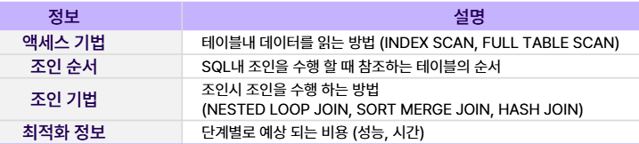
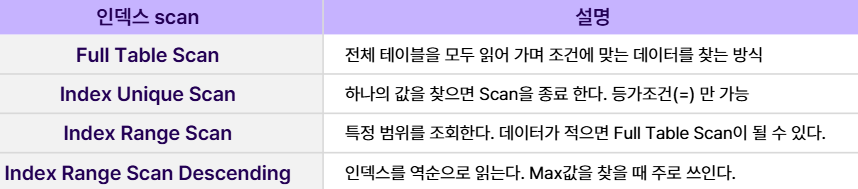

# SQL최적화

 
 

## 옵티마이저와 실행계획
> DBMS 핵심 기능으로 쿼리를 실행할 때 가장 최선의 경로를 찾아주는 엔진

- 규칙기반 : 우선순위(RULE)를 기반으로 실행계획 생성
- 비용기반 : 통계 정보를 사용해 예상 소요시간, 자원 사용량을 계산해 실행계획 선택

 
 

## SQL 최적화 과정

1. SQL Parsing : SQL 문장을 이루는 개별 요소 분석

2. Optimization : 일반적인 쿼리로 변환, 비용계산, 실행계획 후보 선정

3. Row-Source Generation : 실행계획을 실제 실행하는 코드로 포맷

4. Execution : SQL실행

 
 

## 실행 계획
> SQL을 어떤 경로로 실행 할 것인지에 대한 계획으로 동일한 SQL도 실행 계획에 따라 성능이 달라진다.

 
 

## 인덱스
> 데이터를 찾는 속도를 향상시키기 위해 사용하는 기능으로 하나의 테이블에 여러 개 생성이 가능하다.

- 장점 : 검색속도 향상, 시스템 부하를 줄여줌
- 단점 : 추가 저장공간 필요, 생성 시간 필요, 삽입/갱신/삭제 작업시 부하 발생

 

- 인덱스 scan의 종류

 

- b-tree 인덱스 : 트리형식으로 이루어진 인덱스로 등가조건과 범위조건 검색에 적합하다.