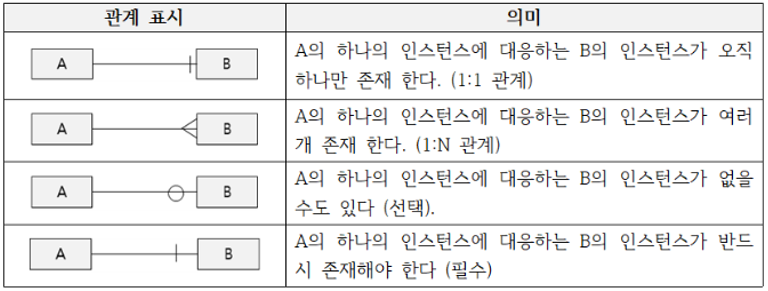
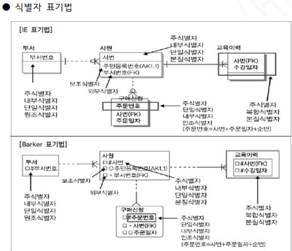
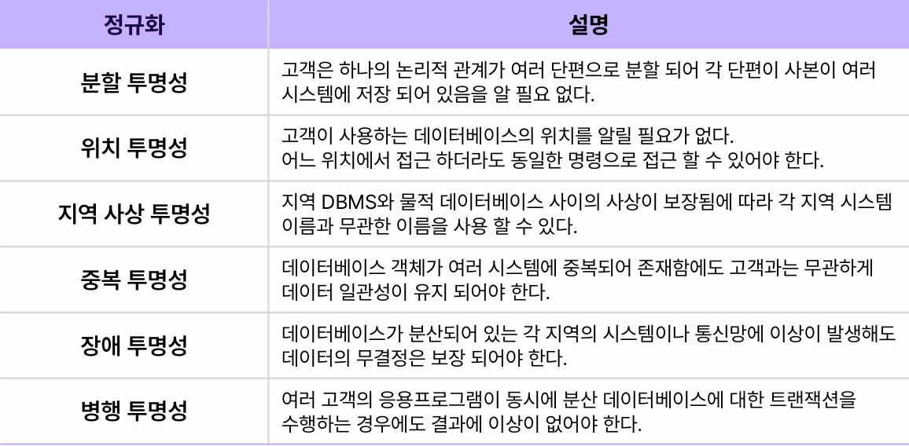
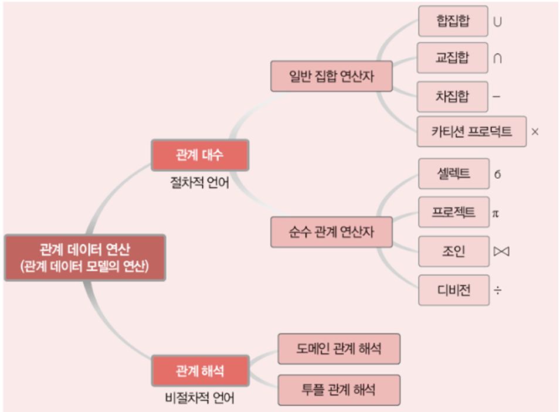

# 1장 데이터 모델링의 이해

## 데이터 모델링
> 현실세계를 데이터베이스에서 표현하기 위한 추상화 과정이다.

<br>

- 특징 : 추상화, 단순화, 명확화
- 고려사항 : 데이터 모델의 독립성, 고객 요구사항 표현, 데이터 품질 확보

<br>

- 데이터 모델링의 단계
```
1. 개념적 모델링 : 핵심 엔티티 도출, 추상화 수준이 가장 높음

2. 논리적 모델링 : 정규화를 통한 데이터 재사용성을 높임, 식별자 정의 및 관계와 속성 표현

3. 물리적 모델링 : 성능, 보안 등을 고려하여 테이블 인덱스 등을 생성하고 데이터베이스를 구축하는 단계
```

<br>

- 데이터 모델링의 관계 
    1. 데이터 : 비즈니스 프로세스에서 사용되는 데이터를 의미
        - 구조분석, 정적분석
    2. 프로세스 : 비즈니스 프로세스에 수행되는 작업
        - 시나리오 분석, 도메인 분석, 동적 분석
    3. 데이터와 프로세스 : 프로세스와 데이터의 관계
        - Create, Read, Update, Delete
    
<br>
<br>
<br>

## 데이터 모델의 표기법(ERD : Entity Relationship Diagram)
> 엔터티(Entity)와 엔터티 간의 관계(Relationship)를 시각적으로 표현한 다이어그램

<br>

- ERD 작성 절차
    1. 엔티티 도출(개체 => 명사 / 관계 => 동사)
    2. 엔티티 배치
    3. 엔티티 관계 설정
    4. 관계명 서술
    5. 관계의 참여도 기술
    6. 관계의 필수 여부 확인


<br>

- 3-Level Schema : 데이터베이스 독립성을 위한 3단계 구조 스키마
    - 사용자(외부 스키마)
    - 설계자(내부 스키마)
    - 개발자(개념 스키마)
<br>

`개념 스키마가 변경되어도 외부 스키마가 영향 받지 않음 => 논리적 독립성` <br>
`내부 스키마가 변경되어도 개념 스키마가 영향 받지 않음 => 물리적 독립성`


<br>
<br>
<br>

## 엔티티
> 현실 세계에서 독립적으로 식별 가능한 객체나 사물을 나타낸다. 인스턴스들로 이루어진 집합이다.

<br>

- 예시
```
- 엔티티 : 학생

- 속성 : 학번, 이름, 학과

- 식별자 : 학번 (고유한 학번을 통해 학생을 식별)

- 인스턴스 : 특정 시점의 저장된 데이터의 집합
    - 학번: 2021001
    - 이름: 홍길동
    - 학과: 컴퓨터 공학
```

<br>

- 특징 
    - 유일한 식별자에 의해 식별 가능
    - 해당 업무에 필요하고 관리하고자 하는 정보
    - 인스턴스들의 집합, 영속적으로 존재하는 2 개 이상의 인스턴스의 집합 
    - 엔티티는 반드시 속성을 가짐, 각 엔터티는 2 개 이상의 속성을 가짐
    - 엔티티는 업무 프로세스에 의해 이용
    - 다른 엔티티와 최소 1개 이상의 관계가 있음

<br>

- 유형과 무형에 따른 엔티티의 종류
    1. 유형 엔티티 : 물리적 형태가 있음(실체가 있는 대상) 
        - ex) 사원, 물품 등
    2. 개념 엔티티 : 물리적인 형태가 없음
        - ex) 조직, 보험상품 등
    3. 사건 엔티티 : 업무 수행에 따라 발생하는 엔티티 (관계)
        - ex) 주문, 청구, 미납


- 발생 시점에 따른 엔티티의 종류
    1. 기본 엔티티 : 그 업무에 원래 존재하던 정보로 자신의 고유한 주 식별자를 가짐
        - ex) 사원, 부서, 고객 등
    2. 중심 엔티티 : 기본 엔티티로부터 발생되고 그 업무에서 중심적인 역할
        - ex) 계약, 사고, 청구, 주문 등
    3. 행위 엔티티 : 2개 이상의 부모 엔티티로 부터 발생
        - ex) 주문(고객과 상품 엔티티 사이에서 발생함) 등

<br>

- 엔터티의 명명
    - 현업에서 사용하는 용어 사용
    - 가능하면 약자 사용은 자제
    - 단수 명사 사용
    - 모든 엔터티에서 유일하게 이름 부여
    - 엔터티 생성 의미대로 이름 부여

<br>

- 엔티티와 인스턴스 표기법



<br>
<br>
<br>

## 속성
> 업무에서 필요로 하는 고유한 성질, 특징을 의미(관찰 대상) => 컬럼으로 표현할 수 있는 단위로, 더 이상 분해되지 않는 최소의 데이터 단위

<br>

- 특징
    - 정해진 주식별자에 함수적 종속성을 가져야 한다.
    - 속성의 무순서 
    - 속성의 원자성, 각 속성이 하나의 값만을 가져야 한다.
    - 속성이름의 유일성

<br>

- 속성의 특성에 따른 분류
    1. 기본 속성 : 업무로부터 추출된 모든 속성으로 일반적으로 가장 많은 속성
        - ex) 원금, 예치기간 등
    2. 설계 속성 : 기본 속성 외에 업무를 규칙화하기 위해 새로 만들거나 기본 속성을 변형하여 만들어지는 속성
        - ex) 상품코드, 지점코드, 예금분류 등
    3. 파생 속성 : 다른 속성에 의해 만들어지는 속성으로 일반적으로 계산된 값들이 해당
        - ex) 합계, 평균, 이자 등

<br>

- 엔티티 구성방식에 따른 분류
    1. PK(Primary Key, 기본키) : 인스턴스를 식별할 수 있는 속성
        - 후보키 중에서 기본적으로 사용되기 위해 선택된 키
        - 후보키는 유일성과 최소성을 만족하는 속성또는 속성들의 집합이다.
    2. FK(Foreign Key, 외래키) : 다른 엔터티와의 관계에서 포함된 속성
    3. 일반 속성 : 엔터티에 포함되어 있고 PK/FK 에 포함되지 않는 속성


<br>

- 분해 여부에 따른 속성
    1. 단일 속성 : 하나의 의미로 구성된 경우
        - ex) 회원 ID, 이름 등
    2. 복합 속성 : 여러개의 의미로 구성된 경우
        - ex) 주소 (시, 구, 동 등으로 분해 가능) 등
    3. 다중값 속성 : 속성에 여러 개의 값을 가질 수 있는 경우, 다중값 속성은 엔티티로 분해한다.
        - ex) 상품 리스트, 취미(취미는 여러개 있을 수도 있음) 등
    
<br>

- 속성의 명명규칙
    - 해당 업무에서 사용하는 이름을 부여
    - 서술식 속성명은 사용하지 않음
    - 약어의 사용은 가급적 제한
    - 전체 데이터 모델에서 유일한 명칭 

<br>

- 도메인 : 각 속성에 저장될 수 있는 후보 값들의 집합

<br>
<br>
<br>

### 함수적 종속성
> 어떤 속성 A의 값에 의해 다른 속성 B도 유일하게 결정된다면 B는 A에 함수적으로 종속됐다고 한다. `A->B` 라고 표현한다.

<br>

1. 완전 함수적 종속 : 속성 Y가 다른 속성 X에 함수적으로 종속되어 있지만, X전체가 아닌 일부분에는 종속되지 않았음을 의미한다. 
    - 쉽게 말해 기본키 전체에 종속된다.

2. 부분 함수적 종속 : 속성 Y가 속성 X의 전체가 아닌 일부분에도 함수적으로 종속됨을 의미한다.
    - 쉽게 말해 기본키 중 일부에 대해 종속된다.

<br>
<br>
<br>

## 관계
> 관계는 엔티티간의 연관성을 나타낸 개념

<br>

- 관계의 종류
    1. 존재적 관계 : 한 엔티티의 존재가 다른 엔티티의 존재에 영향을 미치는 관계
        - ex) 부서 엔티티가 삭제되면 사원 엔티티에도 영향을 미침
    2. 행위적 관계 : 엔티티 간의 어떤 행위가 있는 것을 의미
        - ex) 고객 엔티티의 행동에 의해 주문 엔티티가 발생

<br>

- 관계의 구성
    1. 관계명
    2. 관계의 차수(Cardinality) 
        - 테이블의 차수인 속성의 개수와는 다른 내용임
    3. 선택성(Optionality)

<br>

- 관계의 차수(Cardinality) : 한 엔터티의 레코드(인스턴스)가 다른 엔터티의 레코드(인스턴스)와 어떻게 연결되는지를 나타내는 표현
    - 주로 1:1, 1:N, N:M 등으로 표현 

```
1) 1 대 1 관계
    · 완전 1 대 1 관계
        - 하나의 엔터티에 관계되는 엔터티가 반드시 하나로 존재하는 경우
        ex) 사원은 반드시 소속 부서가 있어야 함
    · 선택적 1 대 1 관계
        - 하나의 엔터티에 관계되는 엔터티가 하나이거나 없을 수 있는 경우
        ex) 사원은 하나의 소속 부서가 있거나 아직 발령전이면 없을 수 있음

2) 1 대 N 관계
    - 엔터티에 하나의 행에 다른 엔터티의 값이 여러 개 있는 관계
    ex) 고객은 여러 개 계좌를 소유할 수 있음.

3) M 대 N 관계
    - 두 엔터티가 다대다의 연결 관계 가지고 있음
    - 이 경우 조인 시 카테시안 곱이 발생하므로 두 엔터티를 연결하는 연결엔터티의 추가로 1 대 N 관계로 해소할 필요가 있음
    ex) 한 학생이 여러 강의를 수강할 수 있고, 한 강의 기준으로도 여러 학생이 보유할 수 있음 => 이 두 엔터티의 연결 엔터티로는 구매이력 엔터티가 필요함
```


<br>

- 관계의 페어링 : 엔티티 안에 인스턴스가 개별적으로 관계를 가지는 것
    - 엔터티(Entity) 사이의 관계를 인스턴스(Instance) 간의 관계로 구체화해서 보여주는 것

<br>

- 관계의 차수, 페어링 차이
    - 학생과 강의 엔터티는 관계를 가짐
    - 한 학생은 여러 강의를 수강할 수 있고, 한 강의도 여러 학생에게 수강될 수 있으므로 M 대 N 관계이며, 이 때 차수는 M:N 가 됨
    - 인스턴스의 관계를 보면 "학생 A 가 강의 B 를 2023 년 1 학기에 수강했고 성적은 'A+'를 받았다"와 같은 특정한 페어링이 형성
    - 이런식으로 관계의 차수는 하나의 엔터티와 다른 엔터티 간의 레코드 연결 방식을 나타내는 반면, 관계의 페어링은 두 엔터티 간의 특정 연결을 설명하고 추가 정보를 제공하는 용도로 사용. 


<br>
<br>
<br>

## 식별자
> 하나의 엔티티에 구성된 여러 개의 속성 중에 엔티티를 대표할 수 있는 속성을 나타낸다. 하나의 유일한 유일한 식별자가 존재해야 한다. 식별자는 논리 모델링에서 사용하는 용어, 물리 모델링에서는 키(key)라고 표현한다.


<br>

- 주식별자 특징
    1. 유일성 : 주식별자에 의해 모든 인스턴스를 유일하게 구분함
    2. 최소성 : 주식별자를 구성하는 속성은 유일성을 만족하는 최소한의 속성으로 구성
    3. 불변성 : 주식별자가 한번 특정 엔티티에 지정되면 그 식별자의 값은 변하지 않아야 한다.
    4. 존재성 : 주식별자가 지정되면 반드시 값이 존재해야 하며 NULL은 허용 안됨

<br>

1. 대표성 여부에 따른 식별자 종류
    - 주식별자 : 유일성과 최소성을 만족하면서 엔티티를 대표하는 식별자
    - 보조식별자 : 유일성과 최소성은 만족하지만 대표성을 만족하지 못하는 식별자

2. 생성 여부에 따른 식별자의 종류
    - 내부식별자 : 다른 엔티티 참조 없이 엔티티 내부에서 스스로 생성되는 식별자
    - 외부식별자 : 다른 엔티티와 관계로 인해 만들어지는 식별자(외래키)

3. 속성 수에 따른 식별자 종류
    - 단일식별자 : 하나의 속성으로 구성
    - 복합식별자 : 2개 이상의 속성으로 구성(복합키)

4. 대체 여부에 따른 식별자의 종류
    - 본질식별자 : 비즈니스 프로세스에서 만들어지는 식별자
    - 인조식별자 : 인위적으로 만들어지는 식별자, 자동 증가하는 일련번호 같은 형태


<br>




<br>
<br>

- 관계간 엔터티 구분
    - 강한 개체 : 독립적으로 존재할 수 있는 엔터티
        - ex) 고객과 계좌 엔터티 중, 고객은 독립적으로 존재할 수 있음
    - 약한 개체 : 독립적으로 존재할 수 없는 엔터티
        - ex) 고객과 계좌 엔터티 중, 계좌은 독립적으로 존재할 수 없음(고객에 의해 파생되는 엔터티) 

<br>
<br>
<br>


## 정규화
> 데이터의 이상현상을 없애기 위해 테이블을 단계를 분해하는 단계

<br>

- 이상현상 : 불필요한 데이터 중복으로 인해 릴레이션에 발생하는 부작용
    - 삽입 이상 : 새 데이터를 삽입하기 위해 불필요한 데이터도 함께 삽입하는 문제
    - 갱신 이상 : 중복 튜플 중 일부만 변경하여 데이터가 불일치하는 모순
    - 삭제 이상 : 튜플을 삭제하면 꼭 필요한 데이터까지 함께 삭제되는 데이터 손실


<br>

```
제1정규화 : 테이블의 모든 속성이 원자 값을 갖도록 한다.

제2정규화 : 제1정규형에 속하고 기본키가 아닌 모든 속성이 기본키에 완전함수종속된다.

제3정규화 : 제2정규형에 속하고 기본키가 아닌 모든 속성이 키본키에 이행적 함수 종속이 일어나지 않는다.
※ 이행적 함수 종속 : 릴레이션을 구성하는 3개의 속성 X,Y,Z에 대해 X->Y와 Y->Z가 존재하면 논리적으로 X->Z가 성립되는데, 이때 Z가 X에 이행적으로 함수 종속되었다고 한다.

보이스/코드 정규화 : 결정자이면서 후보키가 아닌 것 제거

제4정규화 : 다치 종속 제거

제5정규화 : 조인 종속성 이용
```
> 보통 제3정규화까지만 이루어지는 편이다.


<br>


- 반정규화(역정규화 De-Normalization)
    - 데이터베이스의 성능 향상을 위해 데이터 중복을 허용하고 조인을 줄이는 데이터베이스 성능 향상 방법 
    - 시스템의 성능 향상, 개발 및 운영의 단순화를 위해 정규화된 데이터 모델을 중복, 통합, 분리하는 데이터 모델링 기법 
    - 조회(SELECT) 속도를 향상시키지만, 데이터 모델의 유연성은 낮아짐 
    - 반정규화는 정규화를 수행하지 않음을 의미

- 반정규화 수행 케이스 
    - 정규화에 충실하여 종속성, 활용성은 향상되지만 수행 속도가 느려지는 경우 
    - 다량의 범위를 자주 처리해야 하는 경우 
    - 특정 범위의 데이터만 자주 처리하는 경우 
    - 요약/집계 정보가 자주 요구되는 경우 


<br>
<br>
<br>

## 관계와 조인

- 관계 : 엔티티의 인스턴스 사이의 논리적 연관성
    - 존재 관계 : 엔티티 간의 상태를 의미
        - ex) 사원 엔티티는 부서 엔티티에 소속
    - 행위 관계 : 엔티티 간의 어떤 행위를 의미
        - ex) 주문은 고객이 주문할 때 발생

<br>

- 조인 : 관계가 있는 두 테이블을 연결하는 과정

<br>

-  계층형 데이터 모델 
    - 자기 자신끼리 관계가 발생. 즉, 하나의 엔티티 내의 인스턴스 끼리 계층 구조를 가지는 경우
    - 계층 구조를 갖는 인스턴스끼리 연결하는 조인을 셀프조인이라함(같은 테이블을 여러 번 조인)
    - ex) 직원은 자기 자신이 속한 테이블에서 상사를 참조하며, 상사(부모)와 부하(자식) 간의 계층 구조를 형성한다.

<br>


-  상호 베타적 관계
    - 두 테이블 중 하나만 가능한 관계
    - 주문 엔티티에는 개인 또는 법인번호 둘 중 하나만 상속될 수 있음. 즉 주문은 개인고객이거나 법인고객 둘 중 하나의 고객만이 가능

<br>

- 필수적 관계 : 두 엔티티의 관계가 서로 필수적
    - 필수적 관계는 관계선을 실선으로 표기 
- 선택적 관계 : 두 엔티티가 서로 독립적으로 수행이 가능
    - 선택적 관계는 관계선을 점선으로 표기 

<br>
<br>
<br>

## 트랜잭션
> 하나의 작업을 수행하는데 필요한 데이터베이스 연산들을 모아놓은 것으로 논리적인 작업의 단위이다.

<br>

- 트랜잭션의 특성(ACID)
    1. 원자성(atomicity) : 트랜잭션의 연산들이 모두 정상 실행되거나 하나도 실행되지 않아야 함
    2. 일관성(consistency) : 트랜잭션이 성공적으로 수행된 후에도 데이터베이스가 일관된 상태 유지되야 함
    3. 격리성(isolation) : 수행중인 트랜잭션이 완료될 때까지 다른 트랜잭션이 중간에 접근할 수 없어야 한다.
    4. 지속성(durability) : 트랜잭션이 성공적을 완료된 후 데이터베이스에 반영된 결과는 영구적이어야 한다.

<br>

- 트랜잭션의 연산
    - commit : 트랜잭션의 수행이 성공적으로 완료되었음을 선언하는 연산
        - 트랜잭션 수행 결과가 데이터베이스에 반영되고 일관된 상태를 지속적으로 유지
    - rollback : 트랜잭션의 수행이 실패했음을 선언하는 연산
        - 지금까지 실행한 연산의 결과를 취소하고 데이터베이스가 트랜잭션 수행 전의 일관된 상태로 돌아감

<br>
<br>
<br>

## 데이터베이스 구조

1. 중앙집중형 데이터베이스 : 한대의 물리적 시스템에 여러명의 사용자가 접속해서 사용하는 데이터베이스를 중앙집중형 데이터베이스라고 한다.

2. 분산 데이터베이스 : 물리적으로 떨어져 있지만 네트워크로 연결된 단일의 데이터베이스 이미지를 보여주고 분산된 작업을 하는 데이터베이스를 분산 데이터베이스라고 한다.

<br>

- 분산 데이터베이스의 투명성


<br>

- 분산 데이터베이스 설계 방식
    - 상향식 설계 : 지역 스키마 작성 후 전역 스키마 작성
    - 하향식 설계 : 전역 스키마 작성 후 지역 사상 스키마 작성

<br>

- 분산 데이터베이스의 장단점
    - 장점 : 신뢰성과 가용성이 높음, 병령처리로 인한 속도가 빠름, 시스템 용량 확장이 쉬움
    - 단점 : 관리 및 통제 어려움, 보안 관리 어려움, 데이터 무결성 관리 어려움, 데이터베이스 설계 복잡함

<br>
<br>
<br>

## NULL
> 아직 정해지지 않은 값

<br>

- NULL의 특성
    1. NULL을 포함한 연산 결과는 항상 NULL
    2. 집계함수는 NULL을 제외한 연산 결과 리턴


<br>
<br>
<br>

## 관계대수와 관계연산
